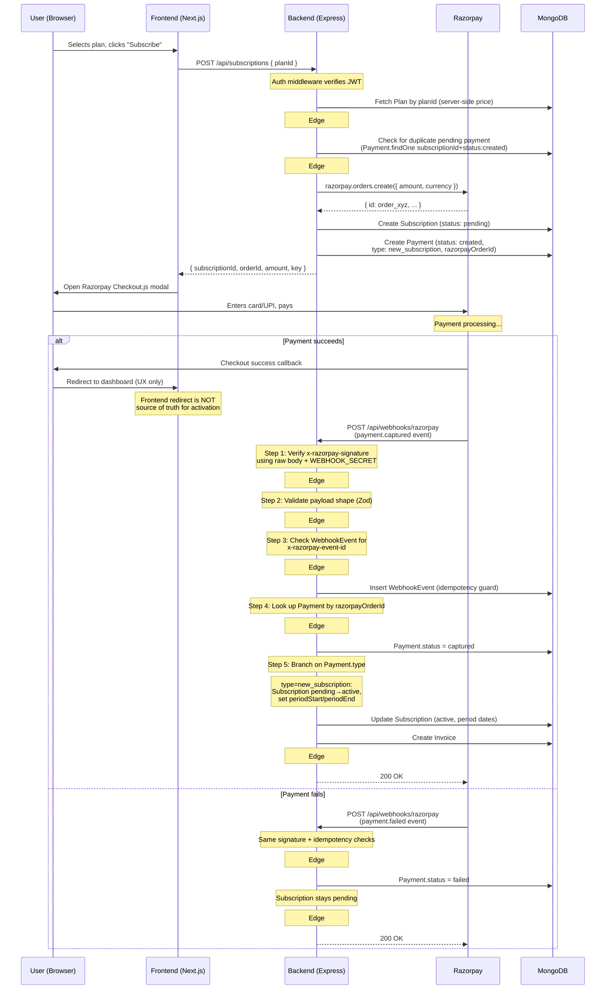

# ARCHITECTURE.md — Subscription Billing Platform

## Overview

A production-grade subscription billing platform built on **Razorpay Orders API** (not Razorpay Subscriptions). The backend manages the full subscription lifecycle — creation, activation, cancellation, expiration, upgrade, and scheduled downgrade — via an explicit state machine, while the frontend provides a clean UI for pricing, checkout, dashboard, and billing management.

---

## Why Razorpay Orders, Not Razorpay Subscriptions

**Explicitly decided:** we build the recurring/upgrade/downgrade state machine ourselves on top of one-time Orders, rather than using Razorpay's native Subscriptions product. This keeps the state machine (`pending` → `active` → `canceled` → `expired`) and idempotency logic fully visible and testable in our own codebase, rather than delegating it to Razorpay's black box. Every state transition, guard, and edge case is traceable to a specific function in `subscription.service.ts`.

---

## Key Architectural Decisions

### 1. Razorpay Orders vs Subscriptions
**Choice:** Orders API.
**Rationale:** See above. Full state machine ownership enables unit-testable lifecycle transitions, custom proration logic, and explicit edge-case handling without relying on Razorpay's webhook semantics for subscription state.

### 2. Test Runner
**Choice:** Bun's built-in test runner (`bun test`).
**Rationale:** Zero-config, Jest-compatible API (`describe`, `test`, `expect`), native TypeScript support without transpilation. No extra dependency needed since Bun is already the runtime.

### 3. Proration Formula
**Choice:** `(daysRemaining / totalDays) × priceDifference` in paise, rounded down via `Math.floor()`.
**Rationale:** Simple, fair, and auditable. Only applies to upgrades — downgrades are scheduled (see Decision #6) and never prorated. All arithmetic uses integers in paise to avoid floating-point precision issues. The formula:
```
daysRemaining = ceil((periodEnd - now) / msPerDay)
totalDays     = ceil((periodEnd - periodStart) / msPerDay)
dailyRateDiff = (newPlan.priceInPaise - currentPlan.priceInPaise) / totalDays
proratedAmount = Math.floor(dailyRateDiff × daysRemaining)
```
Always positive for upgrades (caller validates). Rounding down slightly favors the customer on sub-paise remainders.

### 4. Stale Pending Order TTL
**Choice:** 24 hours. A batch utility marks pending subscriptions older than 24h as abandoned.
**Rationale:** Razorpay Orders expire after a configurable window. A 24h TTL on our side aligns with typical checkout abandonment behavior and prevents stale pending orders from blocking new subscriptions for the same user+plan.

### 5. Price Lock at Subscription Time
**Choice:** Yes — the Plan's `priceInPaise` at the moment of Order creation is what gets stored on the Payment record.
**Rationale:** If an admin changes a plan's price, existing active subscribers must not be silently repriced mid-cycle. The amount charged is always the price that was current when the order was created. Future renewals (out of scope) would pick up the new price.

### 6. Downgrade / Same-Price Switch
**Choice:** Scheduled at next billing cycle — user keeps current plan until `currentPeriodEnd`, plan change takes effect at renewal. No charge for downgrades.
**Rationale:** Consistent with how "cancel" already works (access continues until period end), avoids mid-cycle refund/credit complexity, and matches the standard SaaS pattern (Stripe, etc. behave this way by default). Only upgrades get immediate proration + charge. Downgrades never trigger a Razorpay Order — there's nothing to charge until the next renewal. Implemented via `pendingPlanId` and `pendingPlanEffectiveAt` fields on Subscription, processed by the `processScheduledTransitions()` batch job.

### 7. Late Webhook for Expired Subscription
**Choice:** Ignore — do not reactivate. Log as anomaly.
**Rationale:** Prevents zombie subscriptions. A very late `payment.captured` event for a plan the user already let expire is treated as a no-op. The guard checks subscription status before applying any state change.

### 8. Email Failure Handling
**Choice:** Log and continue — never block payment/subscription state changes.
**Rationale:** Email delivery is best-effort. A Resend API timeout or error should not roll back a successfully captured payment or prevent subscription activation. All email calls are wrapped in try/catch with structured logging. A retry queue could be added later but is out of scope.

### 9. Out-of-Order Webhook Guard
**Choice:** Check `Payment.status` before transition: `captured` is terminal, cannot transition to `failed`.
**Rationale:** Razorpay may deliver events out of order due to retries/delays. If a `payment.failed` arrives after a `payment.captured` for the same order, the guard prevents the stale event from corrupting an already-confirmed subscription.

### 10. Duplicate Pending Orders
**Choice:** Before creating a new order, query `Payment.findOne({ subscriptionId, status: 'created' })` for an existing pending payment. Reuse if < 24h old, otherwise mark the old one abandoned.
**Rationale:** Prevents double-pay scenarios from users clicking "Pay" twice or opening multiple tabs.

### 11. Order Tracking on Subscription (razorpayOrderId removed)
**Choice:** Dropped `razorpayOrderId` from the Subscription model entirely. Payment is the source of truth — query Payment collection for order lookups.
**Rationale:** A single `razorpayOrderId` field on Subscription gets overwritten when an upgrade creates a second Razorpay Order for the same active subscription, which breaks the duplicate-pending-order guard. Payment already stores `razorpayOrderId` per record with full history. Querying `Payment.findOne({ subscriptionId, status: 'created' })` replaces every use case the field served, without the data-loss risk of a convenience pointer.

---

## Data Model

```
┌──────────────┐      ┌──────────────┐      ┌──────────────────┐
│     User     │      │     Plan     │      │  WebhookEvent    │
├──────────────┤      ├──────────────┤      ├──────────────────┤
│ _id          │      │ _id          │      │ _id              │
│ email (uniq) │      │ name         │      │ razorpayEventId  │
│ passwordHash │      │ priceInPaise │      │   (unique index) │
│ name         │      │ billingIntvl │      │ eventType        │
│ createdAt    │      │   Days       │      │ payload          │
└──────┬───────┘      │ features[]   │      │ processedAt      │
       │              │ isActive     │      └──────────────────┘
       │              └──────┬───────┘
       │                     │
       ▼                     ▼
┌──────────────────────────────────────┐
│           Subscription               │
├──────────────────────────────────────┤
│ _id                                  │
│ userId          → User               │
│ planId          → Plan               │
│ status: pending|active|canceled|     │
│         expired                      │
│ currentPeriodStart                   │
│ currentPeriodEnd                     │
│ cancelAtPeriodEnd (bool)             │
│ pendingPlanId   → Plan (nullable)    │
│ pendingPlanEffectiveAt (nullable)    │
│ createdAt                            │
└──────────────┬───────────────────────┘
               │
               ▼
┌──────────────────────────────────────┐
│            Payment                   │
├──────────────────────────────────────┤
│ _id                                  │
│ userId          → User               │
│ subscriptionId  → Subscription       │
│ razorpayOrderId                      │
│ razorpayPaymentId                    │
│ amountInPaise                        │
│ status: created|captured|failed      │
│ type: new_subscription|renewal|      │
│       upgrade|downgrade              │
│ createdAt                            │
└──────────────┬───────────────────────┘
               │
               ▼
┌──────────────────────────────────────┐
│            Invoice                   │
├──────────────────────────────────────┤
│ _id                                  │
│ userId          → User               │
│ subscriptionId  → Subscription       │
│ paymentId       → Payment            │
│ amountInPaise                        │
│ issuedAt                             │
│ description                          │
└──────────────────────────────────────┘
```

**All money fields are integers in paise.** No floats anywhere in money math. Enforced via `utils/money.ts` helpers.

---

## Payment Flow

### New Subscription — Step by Step



### Upgrade (Mid-Cycle) — Proration Payment

1. User requests upgrade: `POST /api/subscriptions/:id/change-plan { newPlanId }`
2. Backend compares prices: `newPlan.priceInPaise > currentPlan.priceInPaise` → upgrade path
3. Clear any existing `pendingPlanId` / `pendingPlanEffectiveAt` (Edge #18: upgrade overwrites scheduled downgrade)
4. Compute prorated amount via `proration.service.ts` (only for remaining days in current cycle)
5. Create Razorpay Order for the prorated difference (server-computed, Edge #6)
6. Create Payment (status: `created`, type: `upgrade`, razorpayOrderId)
7. Frontend opens Razorpay Checkout.js with the order ID
8. On `payment.captured` webhook: `activateSubscription()` branches on `Payment.type === 'upgrade'`:
   - **Does NOT reset** `currentPeriodStart` / `currentPeriodEnd`
   - Sets `planId` to new plan
   - Generates invoice for prorated amount
   - Sends "plan upgraded" email
   - Clears `pendingPlanId` / `pendingPlanEffectiveAt` defensively

### Downgrade (Scheduled)

1. User requests downgrade: `POST /api/subscriptions/:id/change-plan { newPlanId }`
2. Backend compares prices: `newPlan.priceInPaise <= currentPlan.priceInPaise` → downgrade/lateral path
3. **No Razorpay Order created** — nothing to charge
4. Set `pendingPlanId = newPlanId`, `pendingPlanEffectiveAt = currentPeriodEnd`
5. Current plan and access remain unchanged until period end
6. `processScheduledTransitions()` batch job runs after `currentPeriodEnd`:
   - If `cancelAtPeriodEnd === true` → subscription expires (cancel wins, Edge #17)
   - Else if `pendingPlanId` is set → apply: `planId = pendingPlanId`, clear pending fields, roll period forward

### Failed Payment Path

1. Razorpay fires `payment.failed` webhook
2. Signature verification + idempotency check (same as captured path)
3. Guard: if Payment already `captured`, ignore stale event (Edge #8)
4. Mark Payment `failed`, Subscription stays `pending`
5. No invoice generated (Edge #2)
6. Send "payment failed" email

---

## Edge Case Map

| # | Edge Case | Where Intercepted | Resolution |
|---|-----------|-------------------|------------|
| 1 | Payment pending (user closes browser) | `processScheduledTransitions()` batch job | Pending subscriptions older than 24h TTL are marked abandoned |
| 2 | Payment failed | `failPayment()` in subscription.service | No invoice, subscription stays non-active |
| 3 | Webhook delivered twice | `WebhookEvent` unique index on `razorpayEventId` | Second delivery returns 200, no effect re-applied |
| 4 | Cancel semantics | `cancelSubscription()` | `cancelAtPeriodEnd = true`, access until period end, then batch job expires |
| 5 | Upgrade mid-cycle proration | `changePlan()` + `proration.service.ts` | Prorated difference charged via new Order |
| 6 | Client-supplied amount tampering | `createSubscription()` / `changePlan()` | Amount always computed server-side from Plan record |
| 7 | Invalid/missing webhook signature | `webhook.controller.ts` step 1 | Reject 400, log, never process payload |
| 8 | Out-of-order webhook delivery | `activateSubscription()` / `failPayment()` | `captured` is terminal; stale `failed` after `captured` is no-op |
| 9 | Duplicate pending orders | `createSubscription()` queries Payment collection | Reuse pending payment if < 24h, else abandon old |
| 10 | Cancel already-canceled subscription | `cancelSubscription()` | Idempotent no-op |
| 11 | Concurrent upgrade requests (double-click) | `changePlan()` | Check for existing pending upgrade payment before creating new order |
| 12 | Plan price changes after subscription | Payment record | Price locked at order-creation time (Decision #5) |
| 13 | Late webhook for expired subscription | `activateSubscription()` | Ignore, log anomaly, do not reactivate (Decision #7) |
| 14 | Email delivery failure | `notification.service.ts` | try/catch, log and continue, never block state change |
| 15 | Downgrade mid-cycle | `changePlan()` downgrade path | Scheduled for next billing cycle, no charge (Decision #6) |
| 16 | Malformed webhook payload | `webhook.controller.ts` step 2 | Zod validation, reject 400 |
| 17 | Scheduled downgrade then cancel | `processScheduledTransitions()` | Cancellation wins at period end; pending downgrade discarded |
| 18 | Scheduled downgrade then upgrade | `changePlan()` upgrade path | Upgrade clears `pendingPlanId`, creates proration order |
| 19 | Second downgrade replaces first | `changePlan()` downgrade path | `pendingPlanId` overwritten; only one pending change at a time |

---

## Folder Structure Rationale

```
subscription-billing-platform/
├── backend/         # Express.js API — layered architecture
│   └── src/
│       ├── config/      # env validation (Zod), DB connection
│       ├── models/      # Mongoose schemas — data shape only
│       ├── routes/      # Express routers — URL→controller mapping
│       ├── controllers/ # Thin: validate→service→respond
│       ├── services/    # ALL business logic lives here
│       ├── middleware/  # Auth, error handling, request validation
│       ├── validators/  # Zod schemas per route
│       ├── utils/       # Logger, money helpers, ApiError
│       ├── emails/      # Email templates
│       ├── scripts/     # Seed script, batch jobs
│       └── types/       # Shared TypeScript types
└── frontend/        # Next.js 15 App Router
    ├── app/             # Route segments
    ├── components/      # UI atoms + feature components
    ├── lib/             # API client, types, axios config
    ├── hooks/           # Custom React hooks
    └── context/         # React context providers
```

**Why this layering:** Routes define endpoints. Controllers handle HTTP concerns (parsing request, sending response). Services contain all business logic, state machine transitions, and external API calls. Models define data shapes only. This separation means services are independently testable without HTTP overhead, and controllers stay thin enough to be obviously correct.

---

## Webhook Duplicate Testing (Manual)

To test the idempotency guard manually, replay a captured webhook payload:

```bash
# First, capture a real webhook payload from your server logs or Razorpay Dashboard.
# Then replay it with the same event ID:

curl -X POST http://localhost:5000/api/webhooks/razorpay \
  -H "Content-Type: application/json" \
  -H "x-razorpay-signature: <original-signature>" \
  -H "x-razorpay-event-id: <original-event-id>" \
  -d '<original-payload-json>'

# First call: processes the event, returns 200
# Second call (same event ID): returns 200 but applies no effects
# Verify: only 1 invoice in DB, subscription activated only once
```

To generate a test signature for local testing:
```bash
# In Node.js/Bun:
# const crypto = require('crypto');
# const signature = crypto.createHmac('sha256', WEBHOOK_SECRET).update(rawBody).digest('hex');
```
